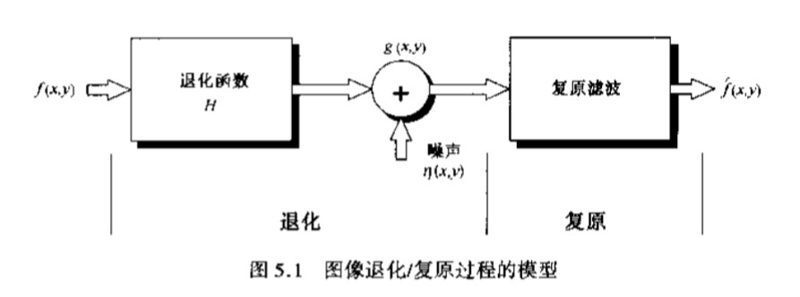
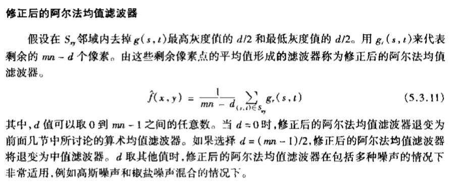
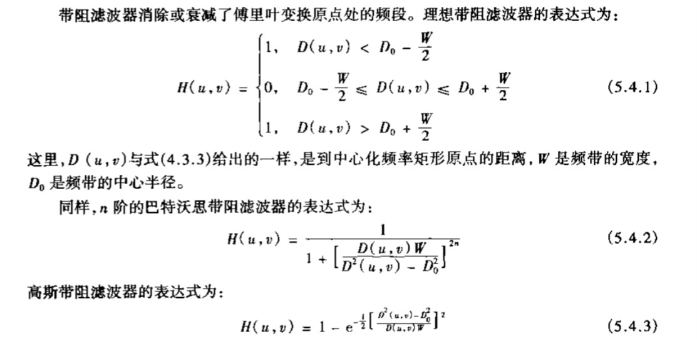
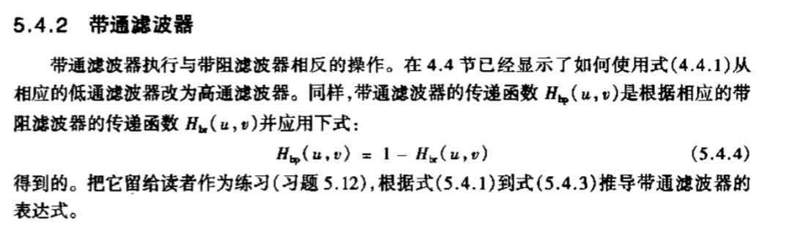
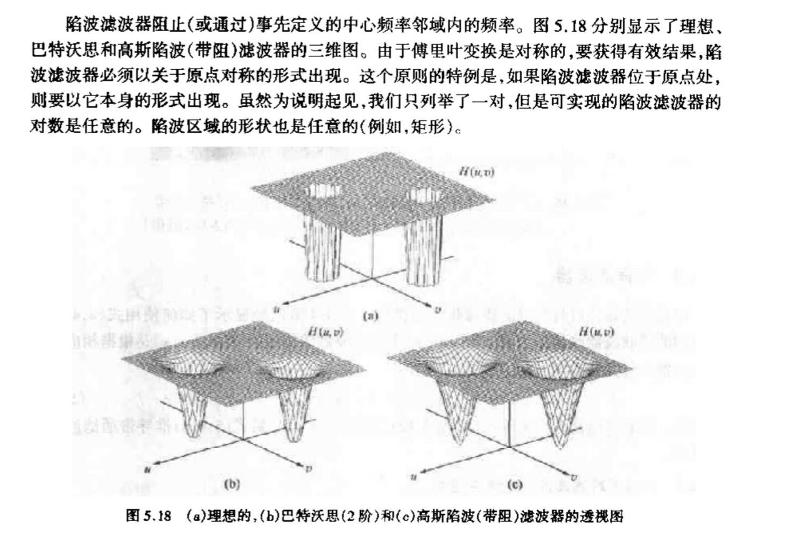
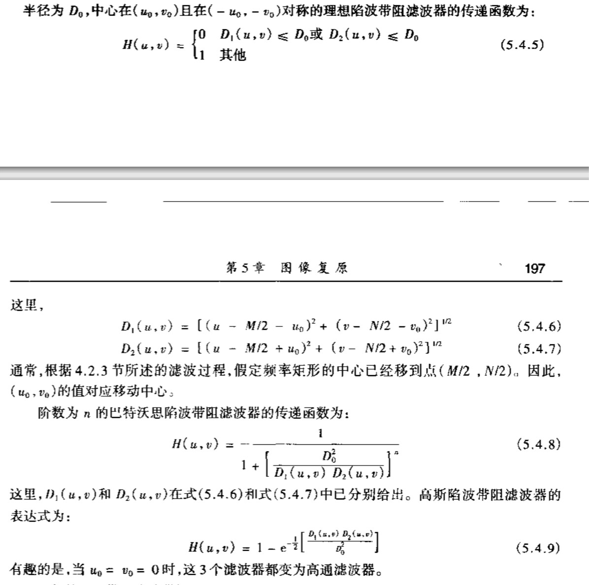
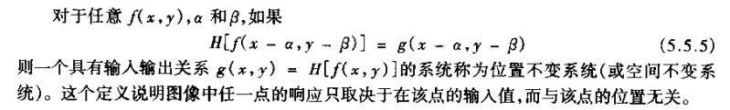
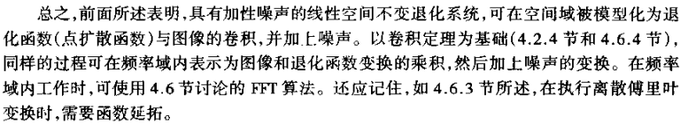

# 第5，6章笔记
## 第5章 图像复原
### 5.1 图像退化/复原过程的模型
图像退化模型
$$g(x,y)=h(x,y)*f(x,y)+\eta(x,y)$$
$$G(u,v)=H(u,v)F(u,v)+N(u,v)$$

### 5.2 噪声模型
#### 5.2.2
* 噪声有高斯噪声、瑞利噪声、伽马噪声、均匀分布噪声、脉冲噪声等
* 脉冲噪声即椒盐噪声，其中，脉冲值为0（黑色）的称之为胡椒噪声，为1（白色）的称之为盐噪声
* 根据某一个随机数发生器，生成另一个随机噪声（另一个随机数发生器）有公式：
  $$ z=F_{z}^{-1}(w) ,F(z)为目标随机噪声的CDF$$
  即解方程$F(z)=w$,得到z与w的关系式即为解
#### 5.2.3
* 周期噪声可以通过频域滤波显著减少
#### 5.2.4 噪声参数的估计
1. 根据灰度直方图中的一小部分判断噪声服从什么分布（高斯？瑞利？）
2.  计算这一部分的均值与方差
$$\mu=\sum z_i p(z_i)$$
$$\sigma^2=\sum(z_i-\mu)^2 p(z_i)$$
3. 根据均值与方差得出噪声分布的各个参数

### 5.3空间域复原滤波
* 算术均值滤波器
* 几何均值滤波器
* 谐波均值滤波器，适合处理“盐噪声”但不适合处理“胡椒噪声”。可以处理高斯噪声
* 逆谐波均值滤波器
$$\hat{f}(x,y)=\frac{\sum_{(s,t)\in S_{x,y}}g(s,t)^{Q+1}}{\sum_{(s,t)\in S_{x,y}}g(s,t)^{Q}}$$
当Q>0时，起增强作用，可以削减胡椒噪声；Q<0时，起削弱作用，削减盐噪声；Q=0即为算术均值滤波器，Q=-1即为谐波均值滤波器
* 中值滤波器，普遍应用
* 最大值滤波器削减胡椒噪声，最小值滤波器削减盐噪声
* 中点滤波器对于高斯和均匀随机分布噪声有较好效果
* 修正后的阿尔法均值滤波器

### 5.4频域削减周期噪声
#### 5.4.1 带阻滤波器

#### 5.4.2 带通滤波器

#### 5.4.3 陷波滤波器

### 5.5 线性、位置不变的退化
定义

### 5.6 估计退化函数
#### 5.6.3 模型估计法
假设快门开馆时间忽略不计，从运动方程估计模糊函数$H(u,v)$的方法：

$$g(x,y)=\int_0^T f[x-x_0(t),y-y_0(t)]dt$$
$$G(u,v)=\int_{-\infty}^{\infty}\int_{-\infty}^{\infty}g(x,y)e^{-j2\pi(ux+vy)}dxdy \\
=F(u,v)\int_{0}^{T}e^{-j2\pi[ux_0(t)+vy_0(t)]}dt$$
$$ \therefore H(u,v)=\int_{0}^{T}e^{-j2\pi[ux_0(t)+vy_0(t)]}dt $$
将运动方程$x_0(t)$与$y_0(t)$代入得到结果
### 5.7 逆滤波
即用退化函数H(u,v)除退化图像的傅里叶变换$G(u,v)$
$$\hat{F}(u,v)=\frac{G(u,v)}{H(u,v)}$$
由于$G(u,v)$包含噪声项N(u,v)，所以得到
$$\hat{F}(u,v)=F(u,v)+\frac{N(u,v)}{H(u,v)}$$
后面那一项并不能很好得出，所以逆滤波效果不佳，应将频率限制为接近原点进行分析。

### 5.8 维纳滤波
考虑了噪声。近似表达式：
$$ \hat{F}(u,v)=[\frac{1}{H(u,v)}\frac{|H(u,v)|^2}{|H(u,v)|^2+K}]G(u,v) $$
### 5.9 约束最小二乘滤波器
#### 定义
根据图像退化的定义：
$$ g(x,y)=h(x,y)*f(x,y)+\eta(x,y) $$
用矩阵形式写出
$$ min C=\sum_{x=0}^{N-1}\sum_{y=0}^{M-1}[\triangledown^2 f(x,y)]^2  \\
S.t ||g-H\hat{f}||=||\eta||$$
由上式可得
$$\hat{F}(u,v)=[\frac{H^*(u,v)}{|H(u,v|^2+\gamma|P(u,v)|^2}]G(u,v)$$
其中$P(u,v)$是拉普拉斯算子$p(x,y)$的傅里叶变换
$$ p(x,y)=\begin{pmatrix}
0 & -1 & 0 \\
-1 & 4 & -1 \\
0 & -1 & 0
\end{pmatrix}$$
#### 具体步骤
定义残差向量$r=g-H\hat{f}$,由于$\hat{f}$和r都是$\gamma$的函数，则$||r^2||$是$\gamma$的单调递增函数
1. 设定一个$\gamma$的初始值
2. 计算$||r||^2$
3. 若满足$||r||^2=||\eta||^2\pm\alpha$则执行第4步，否则调整$\gamma$大小，返回第2步
4. 使用最新的$\gamma$计算
$$\hat{F}(u,v)=[\frac{H^*(u,v)}{|H(u,v|^2+\gamma|P(u,v)|^2}]G(u,v)$$
5. 通过傅里叶反变换得到估计图像

## 第六章 颜色模型
### RGB
* R-红色
* G-绿色
* B-蓝色
### CMY(K)
* C-青色
* M-深红
* Y-黄色
* K-黑色
### YIQ
* Y- 亮度
* I- in-phase 橙色到青色
* Q- Quadrature-phase 紫色到黄绿色
### YCbCr
* Y- 亮度分量
* Cb- 蓝色色度分量
* Cr- 红色色度分量
### HSV
* H- 色调
* S- 饱和度
* V- 明度
$$V=max(max(R,G),B)$$
### HSI
* H- 色调
* S- 饱和度
* I- 亮度
$$ I=\frac{1}{3}(R+G+B) $$
### 一道例题
