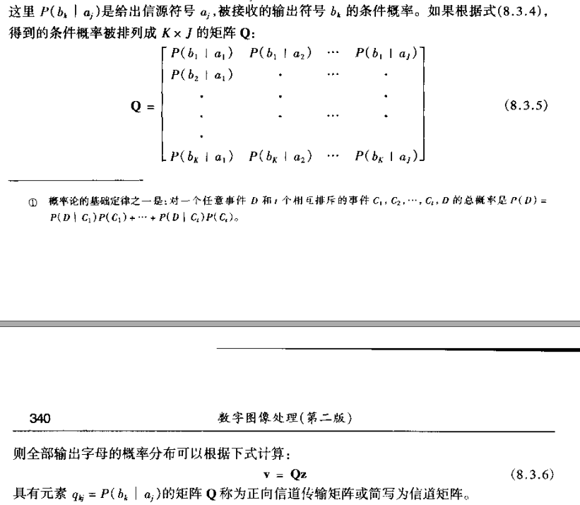

# 图像处理第78章笔记
## 第7章 小波变换
### 7.1.2 子带编码
#### Z变换
$$X(z)=\sum_{-\infty}^{\infty}x(n)z^{-n}$$
##### Z变换的一些结论
若$x(n)$的Z变换为$X(z)$，那么:

1. $(-1)^{n}x(n)$的Z变换为$X(-z)$
2. $x(n-k)\Leftrightarrow z^{-k}X(z)$
3. $x(-n)$的Z变换为$X(\frac{1}{Z})$
4. $\hat{X}(z)=\frac{1}{2}[X(z)+X(-z)]$

#### 频带滤波器组

$$ g_0(n)=(-1)^{n}h_1(n) \\
g_1(n)=(-1)^{n+1}h_0(n)$$
$$ g_1(n)=(-1)^n g_0(2K-1-n)$$
$$ h_i(n)=g_i(2K-1-n),i=\{0,1\}$$
$$ h_0(n)=(-1)^{n+1}h_1(2K-1-n) $$

### 7.2 多分辨率展开
#### 7.2.2 尺度函数
$$\varphi_{j,k}(x=2^{j/2}\varphi(2^jx-k)$$
其中$\varphi(x)$为尺度函数，一般取哈尔尺度函数:
$$ \varphi(x)=\begin{cases}
1,0\leq x<1 \\
0,其它
\end{cases} $$
尺度函数需满足多分辨率分析的4个基本要求
1. MRA要求1： 尺度函数对其整数平移是正交的
2. MRA要求2： 低尺度的尺度函数跨越的子空间，嵌套在高尺度跨越的子空间内
3. MRA要求3： 唯一对所有$V_j$通用的函数是$f(x)=0$
4. MRA要求4： 任何函数都可以按任意精度表示
#### 7.2.3 小波函数
$$\psi_{j,k}(x)=2^{j/2}\psi(2^jx-k)$$
其中$\psi(x)$一般用哈尔小波函数
$$
\psi(x)=\begin{cases}
1,0\leq x<0.5 \\
-1,0.5\leq x<1 \\
0, 其它
\end{cases}
$$
#### 7.3.2 离散小波变换
根据选定的M,J与$J_0$，计算尺度函数与小波函数:
$$ W_\varphi(j_0,k)=\frac{1}{\sqrt{M}}\sum_{x}f(x)\varphi_{j_0,k}(x) $$
$$W_\psi(j,k)=\frac{1}{\sqrt{M}}\sum_{x}f(x)\psi_{j,k}(x)$$
根据尺度函数与小波函数，也可以对原函数进行复原
$$f(x)=\frac{1}{\sqrt{M}}\sum_k W_\varphi(j_0,k)\varphi_{j0,k}(x)+\frac{1}{\sqrt{M}}\sum_{j=j_0}^{\infty}\sum_{k}W_\psi(j,k)\psi_{j,k}(x)$$
其中$x=0,1,2...,M-1,j=0,1,2,...,J-1,k=0,1,2,...,2^j-1$

x均进行过归一化，即除以M，0/M,1/M,...,(M-1)/M
#### 7.4 快速小波变换
##### 原理
某一层的尺度函数和小波函数可以由上一层的尺度函数通过卷积和采样得到，而最上层的尺度函数就是f(x)
$$W_\psi(j,k)=h_\psi(-n)*W_\varphi(j+1,n)|{}_{n=2k,k\geq 0}$$
$$W_\varphi(j,k)=h_\varphi(-n)*W_\varphi(j+1,n)|{}_{n=2k,k\geq 0}$$

##### 样例

## 第8章 信息论
### 自信息
$$ I(E)=log\frac{1}{P(E)}=-logP(E) $$
### 平均自信息
这个量被称为信源的不定度或熵
$$H(z)=-\sum_{j=1}^{J}P(a_j)
logP(a_j)$$
### 互信息

$$H(z|v)=-\sum_{j=1}^{J}\sum_{k=1}^{K}P(a_j,b_k)logP(a_j|b_k)$$
$$I(z,v)=H(z)-H(z|v)$$
$I(z,v)$即为互信息

信道矩阵

$I(z,v)$可以整理为：
$$I(z,v)=\sum_{j=1}^{J}\sum_{k=1}^{K}P(a_j)q_{kj}log\frac{q_{kj}}{\sum_{i=1}^{j}P(a_i)q_{ki}}$$
### 信道容量
$$C=\max \limits_{z}[I(z,v)]$$

