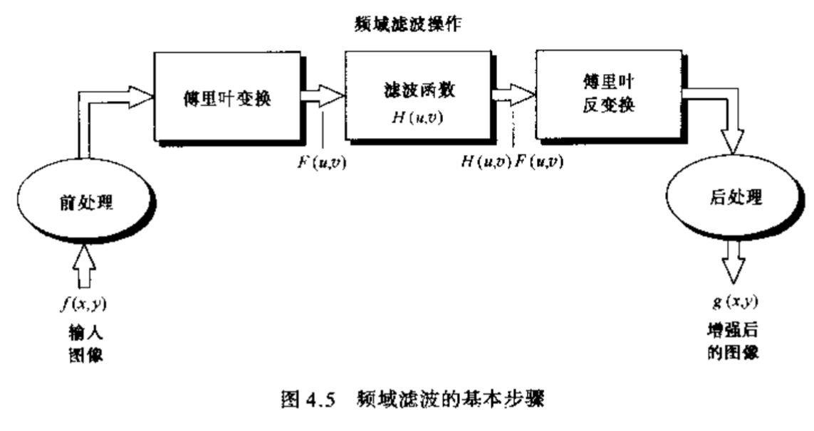

# ImageProcessingNotes
## 第三章 空间域图像增强
### 3.2
* 图像反转 增强位于暗处的白色或灰色细节
* 对数变换 压缩图像像素值动态范围，使傅里叶变换后的频谱能保留大部分细节
$$ s=clog(1+r) $$
* 幂次变换 伽马校正 精确显示图像
$$ s=cr^{\gamma}$$
* 分段线性变换 
  * 对比拉伸 修正低对比度，提高图像处理时灰度级的动态范围
  * 灰度切特 提高特定灰度范围的亮度
  * 位图切割
### 3.3
#### 3.3.1 直方图均衡化
假设r是原灰度级，被归一化到[0,1],r=0表示黑色，r=1表示白色，那么经一个变换$s=T(r)$求得r对应的均衡化后的灰度级s
* * 连续直方图均衡化
公式为：
$$s=T(r)=\int_{0}^{r}p_r(w)dw$$

* * 离散直方图均衡化
1. 根据 
$$ s_k=T(r_k)=\sum_{j=0}^{k}\frac{n_j}{n} ,r_k\in[0,n-1]$$
得到$s_k$

2. 根据$[(n-1)s_k]$得到原灰度级对应的新灰度级
#### 3.3.2 直方图匹配
假设原直方图概率密度分布为$p_r(x)$,目标概率密度分布为$p_z(x)$要将原图转换至新概率密度分布的形式

1. 使用$s=\int_{0}^{r}p(w)dw$对两个概率密度分布均进行直方图均衡化处理，得到s1,s2
2. 根据s1=1=s2,求得r与z的关系，得到变换关系
### 3.5  空间滤波基础
卷积就是要旋转180度再去依次相乘
### 3.6 平滑空间滤波器

#### 3.6.1 平滑均值滤波器

使较小物体的强度与背景混合在一起，较大物体变得像“斑点”而易于检测
#### 3.6.2 统计排序滤波器
典型如中值滤波器，对处理脉冲噪声（即椒盐噪声）特别有效
### 3.7 锐化滤波器
#### 3.7.2 拉普拉斯算子
拉普拉斯算子用来求二阶微分
相较于一阶微分，二阶微分增强细节的能力好一些
一阶微分公式：
$$ \frac{\partial f}{\partial x}=f(x+1)-f(x)$$
二阶微分公式
$$ \frac{\partial^2 f}{\partial x^2}=f(x+1)+f(x-1)-2f(x)$$

拉普拉斯函数
$$ \bigtriangledown^2 f=\frac{\partial^2 f}{\partial x^2}+\frac{\partial^2 f}{\partial y^2}=[f(x+1,y)+f(x-1,y)+f(x,y+1)+f(x,y-1)]-4f(x) $$
该式是各向同性的（旋转不变）

拉普拉斯算子

使用拉普拉斯变换对图像进行增强

出版业常用高提升滤波：
$$ f_{hb}= \begin{cases}
Af(x,y)-\bigtriangledown^2 f(x,y) 如果拉普拉斯掩膜中心系数为负 \\
Af(x,y)+\bigtriangledown^2 f(x,y) 如果拉普拉斯掩膜中心系数为正
\end{cases} $$
典型的有：

#### 3.7.3 一阶微分（梯度算子）

## 第四章 频率域图像增强
### 傅里叶变换公式
* 连续傅里叶变换公式
  
一维情况：
$$ F(u)=\int_{-\infty}^{\infty}f(x)e^{-j2\pi ux}dx,where j=\sqrt{-1} $$
反变换：
$$ f(x)=\int_{-\infty}^{\infty}F(u)e^{j2\pi ux}du$$
二维情况：
$$ F(u,v)=\int_{-\infty}^{\infty}\int_{-\infty}^{\infty}f(x,y)e^{-j2\pi(ux+vy)}dxdy$$
反变换：
$$ f(x,y)=\int_{-\infty}^{\infty}\int_{-\infty}^{\infty}F(u,v)e^{j2\pi(ux+vy)}dudv $$
* 离散傅里叶变换公式
  
一维情况：
$$ F(u)=\frac{1}{M}\sum_{x=0}^{M-1}f(x)e^{-\frac{j2\pi ux}{M}} $$
反变换：
$$ f(x)=\sum_{u=0}^{M-1}F(u)e^{\frac{j2\pi ux}{M}}$$
二维情况：
$$ F(u,v)=\frac{1}{MN}\sum_{x=0}^{M-1}\sum_{y=0}^{N-1}f(x,y)e^{-j2\pi(ux/M+vy/N)}$$
反变换：
$$ f(u,v)=\sum_{u=0}^{M-1}\sum_{v=0}^{N-1}F(u,v)e^{j2\pi (ux/M+vy/N)}$$
* 欧拉公式
$$ e^{j\theta}=cos\theta+jsin\theta$$
$$ e^{j\pi}+1=0 $$
### 二维傅里叶变换的一些性质
* 平移性
$$ f(x,y)e^{j2\pi(u_{0}x/M+v_{0}y/N)}\Leftrightarrow F(u-u_0,v-v_0) $$
$$ f(x-x_0,y-y_0)\Leftrightarrow F(u,v)e^{-j2\pi(ux_0/M+vy_0/N)}$$
* 平移到频率矩阵的中心(M/2,N/2)
$$ f(x,y)(-1)^{x+y}\Leftrightarrow F(u-M/2,v-N/2) $$
$$ f(x-M/2,y-N/2)\Leftrightarrow F(u,v)(-1)^{u+v} $$
* 均值
$$ F(0,0)=\frac{1}{MN}\sum_{x=0}^{M-1}\sum_{y=0}^{N-1}f(x,y)$$
* 共轭对称
$$ F(u,v)=F^{*}(-u,-v)$$
* 对称
$$ |F(u,v)|=|F(-u,-v)|$$
* 可分离性

即可以先求一个维度的，再用中间结果求二维的

* 高斯型低通滤波器的傅里叶变换
$$h(x,y)=A2\pi \sigma^{2}e^{-2\pi^{2}\sigma^{2}(x^2+y^2)}$$
$$H(u,v)=Ae^{-(u^2+v^2)/2\sigma^2}$$
$$h(x,y)\Leftrightarrow H(u,v)$$
* 周期性
$$f(x,y)=f(x+M,y)=f(x,y+N)=f(x+M,y+N) $$
$$F(u,v)=F(u+M,v)=F(u,v+N)=f(u+M,v+N) $$
* 线性
$$ af_1(x,y)+bf_2(x,y)\Leftrightarrow aF_1(u,v)+bF_2(u,v) $$
* 微分

* 拉普拉斯算子的傅里叶变换
$$\bigtriangledown^2f(x,y)\Leftrightarrow -4\pi^2(u^2+v^2)F(u,v)$$
* 卷积
卷积与相乘互相对应

* 相关

* 相似性
$$f(ax,by)\Leftrightarrow \frac{1}{|ab|}F(u/a,v/b)$$

### 频率域滤波

#### 一般步骤
1. 用$(-1)^{x+y}$乘以输入图像来进行中心变换
2. 用（1）结果计算图像DFT，即F(u,v)
3. 用滤波器函数H(u,v)乘以F(u,v)
4. 计算（3）中结果的反DFT
5. 得到（4）结果实部
6. 用$(-1)^{x+y}$乘以（5）中结果

#### 平滑滤波器
傅里叶变换以后产生的频域图，低频在图像中心，高频在图像外围。

平滑滤波器保留中心的低频，衰减外围的高频。
##### 理想低通滤波器

可以用计算机实现，但是不能用电子器件来实现（电子器件无法在某一个点截断）
##### n级巴特沃思低通滤波器
$$H(u,v)=\frac{1}{1+[D(u,v)/D_0]^{2n}}$$
##### 高斯低通滤波器
$$H(u,v)=e^{-D^2(u,v)/2D_0^2}$$

#### 频率域锐化滤波器（高通滤波器）
与低通滤波器相反，有：
$$H_{hp}=1-H_{lp}$$
##### 理想高通滤波器

##### n级巴特沃思高通滤波器
$$ H(u,v)=\frac{1}{1+[D_0/D(u,v)]^{2n}} $$
##### 高斯高通滤波器
$$ H(u,v)=1-e^{-D^2(u,v)/2D_0^2}$$
##### 频率域拉普拉斯（高通）滤波器
$$ H(u,v)=1-4\pi^2(u^2+v^2)$$